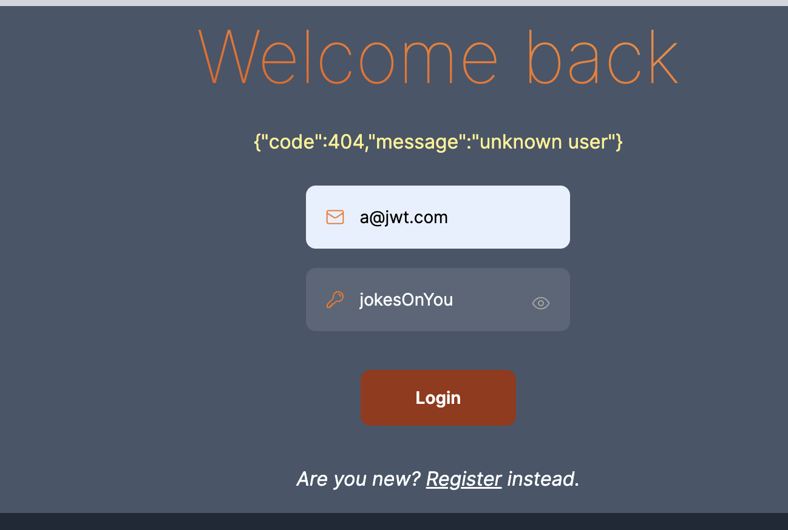
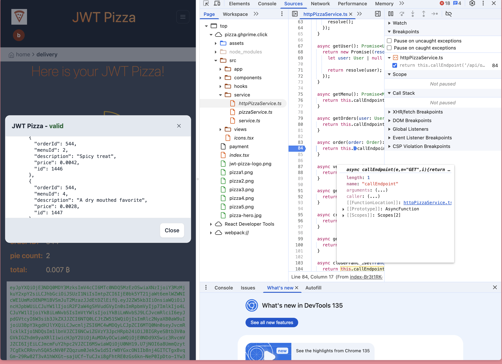

# Self Attacks

## Ben

**Date:** 4/11/25  
**Target Website:** `pizza.pyramidlogging.click`  
**Attack Type:** Server Side Request Forgery  
**Severity:** High/2

**Description of Result:**  
Could easily change quantity/price of pizzas purchased. Very easy to buy all the pizzas
without having to use any bitcoin

**Image:**

**Corrections:**  
Given the itemID, query the menu to get the actual desciption and price of the item.
This way the price and description could not be injected

---

## Gavin

**Date:** 4/10/25  
**Target Website:** `localhost:3000`  
**Attack Type:** Injection  
**Severity:** High/2

**Description of Result:**  
I could hijack the admin credentials and log in as the admin using my own credentials.

**Images:**  

**Corrections That Were Made:**  
I rewrote the whole thing in TypeScript, and when I did, I corrected this by not allowing unsanitized data (the email & ID) to be injected.

---

# Peer Attacks

## Ben Attacks Gavin

**Date:** 4/11/25  
**Target Website:** `pizza.ghprime.click`  
**Attack Type:** Server Side Request Forgery  
**Severity:** High

**Description:**  
I tried to change the price of pizzas to be free. I also tried to change the id of the pizza. That worked,
but then the joke was on me, because it changed the order and to a pizza I didn't want.

**Image:**  

**Correction:**  
He fixed it by getting the prices and descriptions from the database rather than the request.

---

## Gavin Attacks Ben

**Date:** 4/11/25  
**Target Website:** `localhost:3000`  
**Attack Type:** Injection  
**Severity:** High/2

**Description of Result:**  
I used a SQL injection attack to override the email and password of `userId 1` (which is the admin).  
Thus, I could hijack the admin credentials and log in as the admin using my own credentials.

**Images:**  

**Corrections That Were Made:**  
I rewrote the whole thing in TypeScript, and when I did, I corrected this. I fixed it by not allowing unsanitized data (the email & ID) to be injected.

---

# Combined Summary of Learning

- Sanitizing your database inputs is important.
- Don’t rely on user input for anything but the necessary:
  - ✅ Username → Yes
  - ❌ Prices → No
- Just because no one has hacked it yet doesn’t mean it’s secure.

# FYI

I did this with Gavin, but also did it in part with Josh.
